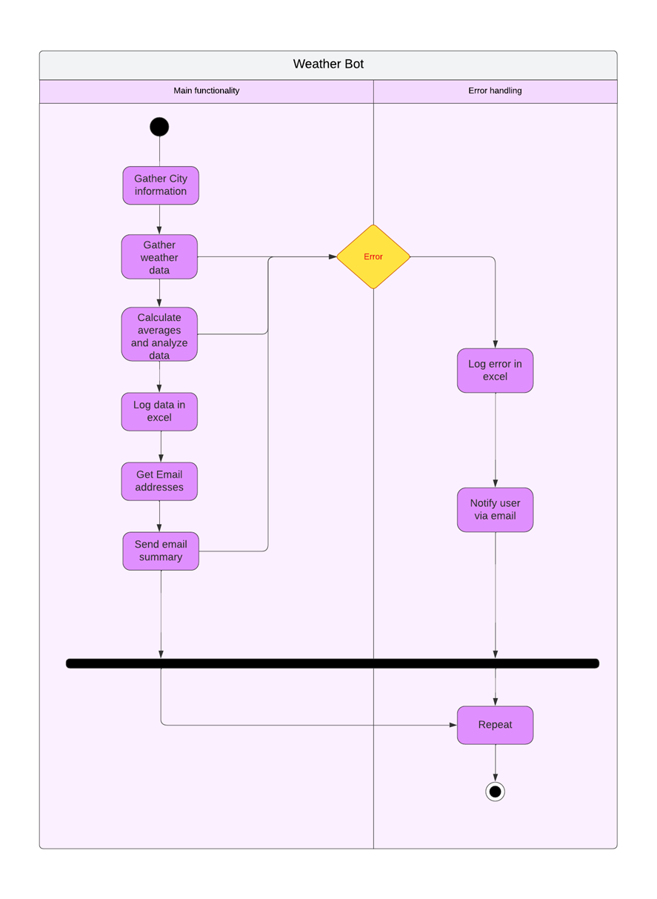

# Weather Bot
Gathers information from a weather service and calculates averages based on the data from multiple services. The results are sent to the user via e-mail, and errors, etc. are logged in to an excel file.

# Usage

## Locations
Locations are set in Locations.xlsx

## Users
Users are set in Users.xlsx
The format is email to "Recipient List" and their role to the "Role" field, mainly "Administrator" or "Recipient"

# Process Definition

## Functionalities:
• Collects information from multiple weather services (e.g., OpenWeatherMap, Weather.com, and local weather stations) to ensure comprehensive and reliable data.
• Calculates averages for different weather parameters (e.g., temperature, humidity, wind speed) and ensure that calculations are accurate and up to date.
• Sends e-mails automatically, e.g., every 3 days, or once a week on Monday.
•	List all the users in an excel file, so that the robot knows who to send the emails to.
• Handles errors and ensures that the robot notifies an admin-user if it encounters issues with data collection or sending e-mails.
•	Reports errors in an excel spreadsheet
• Formats the e-mail report clearly and makes it easy to read. HTML formatting can be used to make the report look professional.
•	Fills emails with the data and sends is to the users
•	We should have a method for the robot to know what cities/areas the weather data needs to be collected for.

## Additional functionalities:
• Add graphical representations to the e-mail report, such as charts and graphs showing changes in temperature and humidity over time.
• Compare current weather conditions with historical data and include an analysis in the report on how current conditions deviate from the averages.
• Integrate real-time data with weather forecasts and provide predictions for upcoming days. This can help give a better understanding of future weather conditions.
• Report who received the weather information and when it was sent, e.g., log the data in Excel.
• Customizable notifications: Offer the ability to customize notifications so users can choose when and what kind of changes they want to be notified about.

